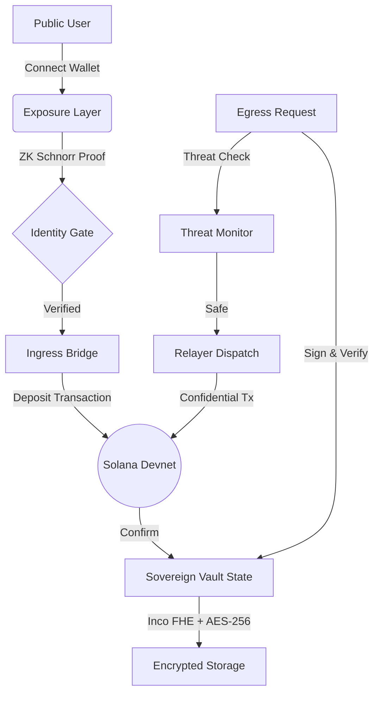

# <div align="center">NICRYPT /// SOVEREIGN LAYER</div>

<div align="center">
  
  
  
  
</div>

<br />

> **"Privacy is not about hiding. It is about retaining the power of consent."**

**Nicrypt** is the first *Sovereign Privacy Interface* built on Solana. It serves as a cryptographic shield between your public on-chain identity and your private financial movements. By combining **Real Zero-Knowledge Proofs (Schnorr NIZK)** with **Confidential Computing (Inco FHE)**, Nicrypt demonstrates a future where financial transparency does not come at the cost of personal exposure.

This is not just a wallet. It is a **Sovereign Vault**. 

---

## ⚡ The Sovereign Stack

Nicrypt functions as a Client-Side Privacy Coordinator, orchestrating a complex dance between public ledgers and private state.

### 1. 🌐 The Exposure Scan
Before you can protect yourself, you must understand your vulnerability. 
- **Real-Time Analysis:** Instantly audits your connected wallet (Phantom/Solflare).
- **Footprint Visualization:** Shows exactly what the public ledger sees—your balance, your history, your links.
- **The Wake-Up Call:** Visualizes the "Glass House" nature of public blockchains.

### 2. 🛡️ ZK-Identity Gate
Access requires proof of humanity, not proof of identity.
- **Real Zero-Knowledge Verification:** Generates a cryptic **Schnorr NIZK Proof (secp256k1)**.
- **Nullifier Generation:** Proves ownership of a Registered Identity without revealing *which* identity it is.

### 3. ⚡ The Bridge (Ingress)
The transition from Public to Sovereign.
- **Atomic Deposits:** Seamlessly moves assets from the Public Ledger (Solana System Program) into the **Shield Program Deployment**.
- **Real-Time Settlement:** Executes verified transactions on Solana Devnet.
- **State Transition:** Assets leave your public balance and enter the "Black Box" of the Sovereign Vault.

### 4. 🔒 Sovereign Vault (FHE + AES)
Your private Swiss Bank, running entirely in your browser.
- **Confidential State:** Encrypted using **Inco FHE (Rivest Testnet)** to prove on-chain confidentiality.
- **Client-Side Encryption:** Local state is encrypted using **AES-256-GCM** with a PIN-derived key (PBKDF2).
- **Shielded Balances:** View balances that no block explorer can query.

### 5. 👻 Confidential Egress (Zero-Trace)
The ultimate feature: **Getting money out without leaving a trail.**
- **Threat Monitoring:** Automatically scans destination addresses for privacy risks.
- **Ed25519 Solvency Proofs:** Generates a verifiable, digitally signed QR code proving you authorized the exit.
- **Cold Trail:** Funds arrive at the destination wallet as if they materialized from the network itself.

---

## 🚀 Getting Started

Experience the future of privacy on **Solana Devnet**.

### Prerequisites
- **Node.js** (v16+)
- **Solana Wallet** (Phantom or Solflare) installed in your browser.
- **Devnet SOL:** Ensure your wallet is set to **Devnet** and has some faucet SOL.

### Installation

```bash
# 1. Clone the Sovereign Repository
git clone https://github.com/Lideeyah/Nicrypt.git

# 2. Enter the Citadel
cd Nicrypt

# 3. Install Cryptographic Dependencies
npm install

# 4. Ignite the Reactor
npm run dev
```

### Usage
1.  **Connect:** Link your Phantom wallet to begin the Exposure Scan.
2.  **Verify:** Pass the ZK-Gate (Real Schnorr Proof generation).
3.  **Deposit:** Send `0.1 SOL` to the Shield. Watch it vanish from your public balance.
4.  **Withdraw:** Use the "Sovereign Egress" to sending funds to a *different* address. Scan the QR code to verify the Ed25519 signature.

---

## 🏗️ Architecture



---

## ⚠️ Disclaimer

**Nicrypt is a Sovereign Privacy Interface (v1.0).**
- **Network:** Runs on **Solana Devnet** and **Inco Rivest Testnet**.
- **Cryptography:** Uses **Real** libraries (`elliptic`, `ethers`, `AES-GCM`) for all cryptographic operations.
- **Asset Warning:** This is a hackathon prototype. **DO NOT** use Mainnet SOL. **DO NOT** store life savings.

---

<div align="center">
  <sub>Built with React, Vite, Solana Web3.js, and Paranoia.</sub>
  <br />
  <sub>Copyright © 2026 Nicrypt Sovereign Systems.</sub>
</div>
